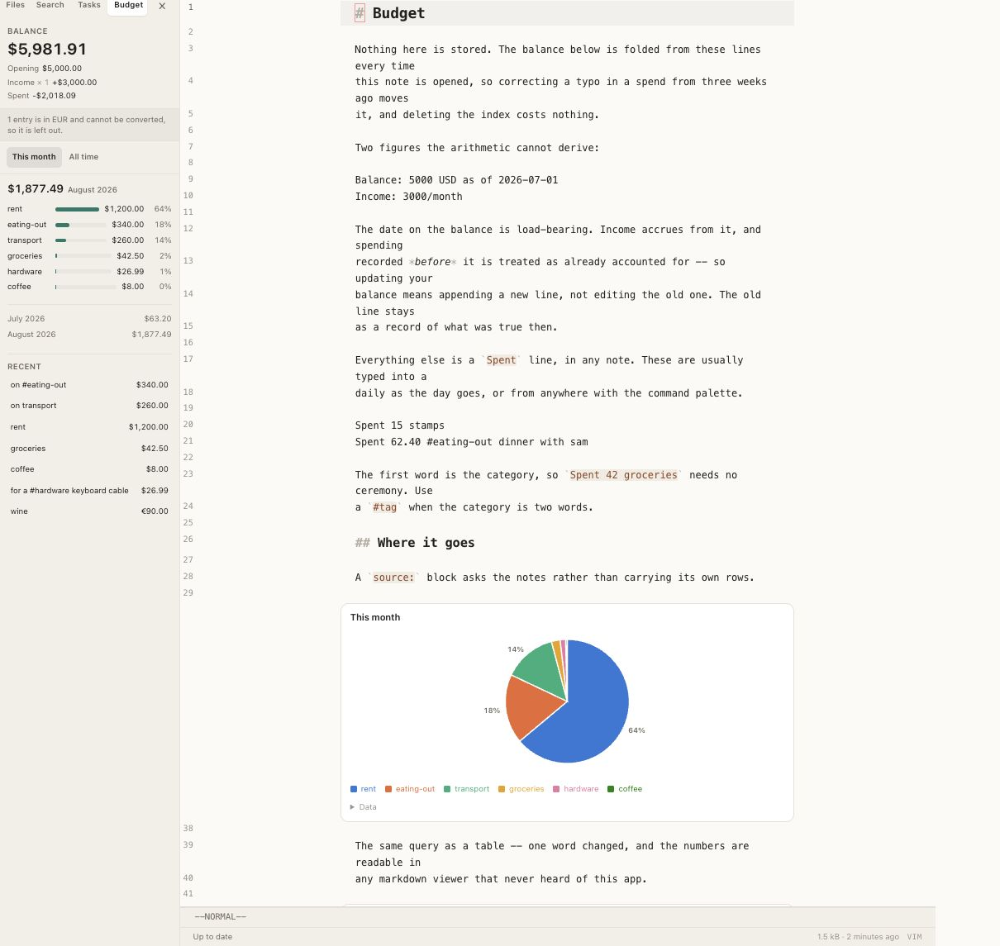
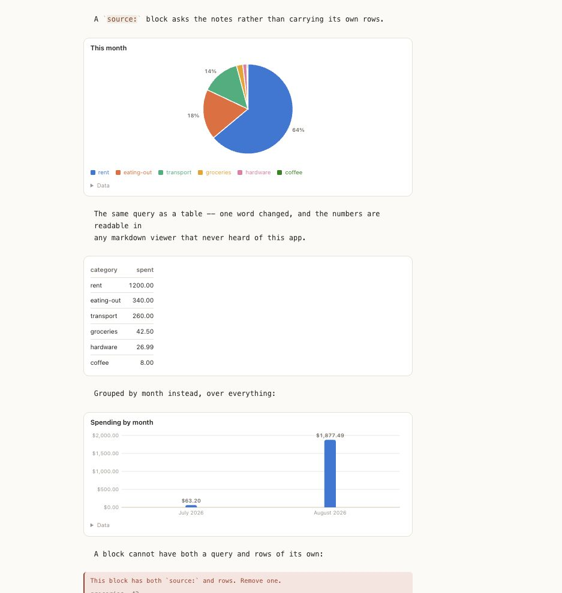

# vim-notes

Self-hosted notes that are just markdown files in a git repo, reachable from
anywhere. A real shell — and your own nvim — in the browser when you have a
keyboard; a plain markdown editor when you are on a phone.

The repo is the product — this is an access layer over it. Notes stay useful
even if the whole stack goes away: `git clone` and they are all there.

## What it is

| Client      | Where it runs    | What it is                                                                                                                         |
| ----------- | ---------------- | ---------------------------------------------------------------------------------------------------------------------------------- |
| `/term`     | work PC, desktop | xterm.js over a WebSocket into a real login shell in a pty — run commands, or type `nvim` and get your `init.lua` and your plugins |
| `/`         | phone, anywhere  | PWA with CodeMirror 6, file tree, search. Vim keys on with a keyboard, off on touch                                                |
| desktop app | macOS / Windows  | thin Tauri shell around the same web client, mainly for keyboard capture                                                           |

Both clients read and write the same `~/notes/*.md` directory. Saves
auto-commit and push to a private GitHub repo, so a laptop clone is a first-class way to
work too.

## What it looks like

The same note, in the browser and in real nvim. Both are reading the same file
on disk — edit it in either, or with any other program, and the other notices.

|                                                     |                                                         |
| --------------------------------------------------- | ------------------------------------------------------- |
|           |  |
| CodeMirror, with wikilinks and backlinks resolved   | `/term` — a shell, with actual nvim a command away      |
|                 |                 |
| `TODO` and `Reminder` lines, grouped by day and due | Notes, days, todos and reminders, and what links them   |

Nothing in those screenshots is stored anywhere but the markdown. The task
list, the due dates, the links and the graph are all parsed back out of the
files every time, which is why a `TODO` typed in nvim shows up in the panel
without nvim knowing this application exists.

## Data blocks

A ` ```chart ` fence is drawn rather than shown. Put the cursor in one and
it is text again — there is no preview pane, so editing a chart is editing the
markdown that makes it.

````markdown
```chart
type: bar
title: Hours on the thing
month, building, reading
May, 34, 12
June, 41, 9
```
````

Options go above the rows, one per line: `type`, `title`, `x`, `y`, `stacked`,
`legend`, `format`, `currency`, `sort`, `height`. Rows are a markdown pipe table
or plain CSV, whichever suits — the first column is the labels, the rest are the
values. Types are `bar`, `line`, `pie` and `table`; `table` is the default and
the only one that never has to be numeric, so changing one word turns a chart
into its own data and back.

The block is **parsed and drawn, never executed** — there is no transpile step
and no `eval` anywhere in it. Notes arrive over git from a remote nothing
protects from a force-push, so a note that draws a chart must not be a note that
runs code. See DECISIONS.md §14.

## Budget

The same idea, applied to money. `Spent 42 groceries` is a line in a note, and
so are the two figures the arithmetic cannot derive:

```markdown
Balance: 5000 USD as of 2026-07-01
Income: 3000/month

Spent 1200 rent
Spent 62.40 #eating-out dinner with sam
Spent 25 books 2026-07-15
```

|                                                          |                                                            |
| -------------------------------------------------------- | ---------------------------------------------------------- |
|           |  |
| Balance, categories and recent entries, folded on render | One query, three renderings — and it says what it left out |

**There is no stored balance.** It is `opening + accrued income − spending
since the anchor date`, recomputed every render, so correcting a typo in a
spend from three weeks ago moves it and deleting the index costs nothing.
Updating your balance is an _append_ — the latest `as of` date wins, and the
old line stays as a record of what was true then.

The first word is the category, so `Spent 42 groceries` needs no ceremony; a
`#tag` handles the cases where one word is not enough. Amounts are integer
minor units parsed by string surgery, never `parseFloat`, because a budget is a
long chain of additions and that is exactly where float error compounds.

Currencies are **never converted** — there is no exchange rate here to be right
about, so a spend in another currency is left out of the total and the panel
says so rather than adding 50 EUR to 50 USD and calling it 100 of something.

Press <kbd>⌘K</kbd> from anywhere and type it the way you would say it —
`i spent 33.50 on books`. The command box is forgiving; the line it writes to
today's journal is the canonical `Spent 33.50 on books`, because the file is
the only thing anything reads back.

A ` ```chart ` block can ask the notes for its rows instead of carrying them:

````markdown
```chart pie
title: This month
source: spend
group: category
since: 2026-08-01
```
````

That keeps §14's rule — a query is a declaration, not a program, and nothing is
executed — but it costs §14's other property, which is worth saying plainly: a
literal block is readable as data in nvim and in GitHub's web view, and a
derived one is not. Changing `pie` to `table` is the way back. See
DECISIONS.md §15 and §16.

## Layout

```
packages/
  core/      ports, NotePath, conflict rules, wire schemas — no I/O, no Node builtins
  server/    adapters (fs, git, pty, ripgrep, chokidar), tRPC API, composition root
  web/       React + CodeMirror + xterm, vertical feature slices, platform port
  desktop/   Tauri shell
```

`core` is the interior of the hexagon and imports nothing outward. That is
enforced by lint, not by convention — see `eslint.config.js`.

## Development

Requires Node 22+ and pnpm (via corepack).

```bash
corepack enable pnpm
pnpm install

git init notes-dev   # see below — required, once

pnpm dev          # server + web in parallel
pnpm test         # vitest across packages
pnpm typecheck
pnpm lint
pnpm verify       # typecheck + lint + format + test, same as CI
```

Point the server at a notes directory with `NOTES_ROOT` (defaults to
`./notes-dev`, which is gitignored).

`pnpm dev` runs the web client against the real server: Vite proxies `/trpc` to
it, including the WebSocket the file watcher streams over. To work on the UI
with no server, no notes directory and no git, run the client against its
built-in fake instead:

```bash
VITE_PLATFORM=memory pnpm --filter @vim-notes/web dev
```

That serves seeded notes from `InMemoryPlatform` and turns on the `demo` menu in
the header, which fakes nvim and git writing to the directory so the conflict
and reconcile paths can be reached without a terminal. It is gated on Vite's
`DEV` flag, so a production build compiles the option away entirely rather than
leaving a switch a deployed client could be talked into.

**The notes directory has to be its own git repository**, and the server refuses
to start otherwise. That is not pedantry. `./notes-dev` sits inside this
repository, so without its own `.git` it inherits this one — and then
auto-commit either records nothing at all (because the path is ignored) or
starts committing this repository's source tree into its own history. Both fail
silently: saves work, commits report "nothing to commit", and history quietly
stops. Preflight checks it at boot and prints the exact command to fix it.

The server also needs `git`, `ripgrep`, `bash` and `nvim` on `PATH`. A missing
`git` is fatal for the same reason; the others only disable search, the terminal
and editing in it, and are reported at startup rather than at the moment you
reach for them. `nvim` is checked even though nothing launches it any more —
`/term` is a shell, so it is a command you type, and a box that forgot to
install it would otherwise look perfectly healthy until you tried to edit.

## Why it is built this way

See [DECISIONS.md](./DECISIONS.md) — including the parts that are deliberately
_not_ built, and the honest limits of the idea.
